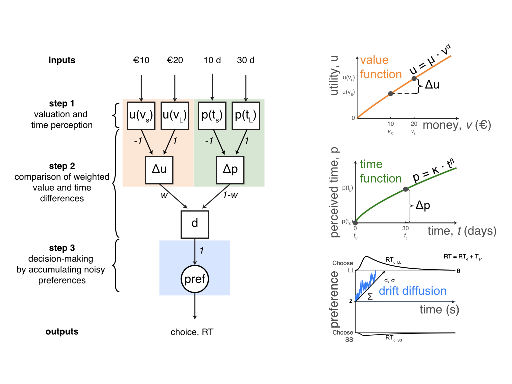

# itchmodel - Intertemporal choice model

## Overview
`itchmodel` is a computational model that can be used to test two framing effects in intertemporal choice: the __defer/speedup effect__ (also known as the delay/speedup effect) and the __date/delay effect__. 

The model is based on two tradeoff models of intertemporal choice: one that can account for the defer/speedup effect in intertemporal choice [Scholten & Read, 2013](https://doi.org/10.1037/a0031171) and another that can explain choice probabilities and full response time distributions in intertemporal choice [Dai & Busemeyer, 2014](https://doi.org/10.1037/a0035976).

## Description

Conceptually, the model explains intertemporal choice as a __three-step process__:



1. A decision maker transforms money into utility (value function), and calendar time into perceived/weighted time (time function), separately for the small-but-sooner and large-but-later options. These value and time functions are governed by power transformations.

2. Differences in utility are compared against differences in perceived/weighted time with different attentional weights (_w_ is the amount of attention allocated to the money attribute, _(1-w)_ is interpreted as the the amount of attention allocated to the delay attribute), resulting in _d_, the overall advantage of the large-but-later option over the small-but-sooner option.

3. The parameter _d_ is accumulated over time (i.e. diffusion or sequential-sampling process) to a threshold that triggers an explicit preferential choice, providing predicted choice and response time.

The current version of the model allows for 2 __parameterizations__ for each framing effect:

1. Parameter _mu_ varies between frames, corresponding to the hypothesis that time framing influences valuation.

2. Parameter _kappa_ varies between frames, corresponding to the hypothesis that time framing influences time weighting/perception.

## Installation

The model can be installed from R as follows:
```
devtools::install_github("bramzandbelt/itchmodel")
library(itchmodel)
```

## Usage

Usage will be explained in more detail soon. In the meantime, see the R Markdown notebooks inside the `analysis` directory for usage examples.

## Colophon

### Version

0.0.1 - June 2018

### Contact

E-mail: bramzandbelt@gmail.com

### References

- Scholten, M. & Read, D. (2013) Time and outcome framing in intertemporal tradeoffs. Journal of Experimental Psychology: Learning, Memory, and Cognition, 39, 1192–1212.

- Dai, J. & Busemeyer, J.R. (2014) A probabilistic, dynamic, and attribute-wise model of intertemporal choice. Journal of Experimental Psychology: General, 143, 1489–1514.
